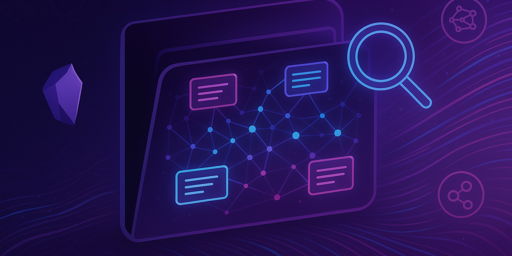

# 

# daz obsidian mcp

**A powerful toolkit for indexing, searching, and serving Obsidian notes with natural language queries via ChromaDB and Model Context Protocol (MCP).**

---

## 🚀 Features

- **Automatic Indexing**: Watches your Obsidian vault and indexes Markdown files into overlapping content chunks for fast semantic search.
- **Vector Search**: Leverages ChromaDB to find relevant snippets or entire note contents for any query.
- **MCP Server**: Exposes search tools via the Model Context Protocol, compatible with AI-powered workflows.
- **Flexible Setup**: Supports vault autodiscovery or configuration via environment variables.
- **Live Updates**: Near real-time updates as your vault changes.

---

## 📁 Project Structure

- `scanner.py` — File watcher and content indexer for your Obsidian vault
- `daz-obsidian-mcp.py` — MCP server exposing semantic search tools (snippets/full article)
- `search.py` — Simple CLI search/test utility
- `obsidian_chromadb/` — Directory where the vector store (ChromaDB) is kept

---

## 🛠️ Setup

### 1. Requirements

- Python 3.8+
- pip (`pip install -r requirements.txt` — see below)

**Dependencies:**

- `chromadb`
- `watchdog`
- `mcp` (Model Context Protocol Python SDK)

Install with:

```bash
pip install chromadb watchdog mcp
```

---

### 2. Connect Your Obsidian Vault

By default, the indexer will try to auto-discover your vault (macOS conventions supported):

- `~/Documents/Obsidian/` or `~/Library/Mobile Documents/iCloud~md~obsidian/Documents/`

**Custom Vault:** Set the environment variable before running:

```bash
export OBSIDIAN_VAULT_PATH=/path/to/your/ObsidianVault
```

---

## 🔎 Usage

### 1. Index Your Vault (Run the Watcher)

```bash
python scanner.py
```

This script creates/updates the vector database in `obsidian_chromadb/`, performing full and incremental indexing as your .md files change.

### 2. Test Search Manually (Optional)

```bash
python search.py
```

- Check chunk counts
- Run basic test queries
- Preview sample indexed files

### 3. Connect the MCP Search Server in Your AI App/Client

Instead of running the server manually, add the following command to your Claude Desktop, ChatGPT, or other MCP-compatible client as a tool/plugin configuration:

```
python daz-obsidian-mcp.py
```

This lets your chosen client/tool launch and interact with the server directly. See your platform's documentation for how to add a custom tool/command.

---

## 🧑‍💻 Example MCP Tool Usage

#### Query for Snippets:

```json
{
  "tool": "search_snippets",
  "arguments": { "query": "What is spaced repetition?", "limit": 5 }
}
```

#### Query for Full Note Content:

```json
{
  "tool": "search_full",
  "arguments": { "query": "zettelkasten", "limit": 2 }
}
```

---

## 📝 Notes & Troubleshooting

- If you see "ChromaDB database not found", run `scanner.py` first.
- To re-index everything: delete the `obsidian_chromadb/` folder and metadata, rerun the indexer.
- Chunking is overlapping; deduplication for full-text is handled simply by concatenation.
- UTF-8 Safety: Chunks are tokenized on byte-level but also respect character boundaries to avoid decode errors.

---

## 🗂️ License

MIT License (c) 2024 — Your Name Here

---

## 🙏 Acknowledgements

- [ChromaDB](https://www.trychroma.com/)
- [Obsidian](https://obsidian.md/)
- [MCP](https://github.com/modelcontext/protocol)
- [Watchdog](https://python-watchdog.readthedocs.io/)

---

> ⬆️ _Add your own **banner.jpg** image at the top of this folder to complete the visual branding!_
